# OpenType MATH support in TeXmacs (branch `wip_opentype`)

This branch teaches TeXmacs to typeset mathematics with the data an OpenType
math font carries in its `MATH` table, instead of the hand-made constructions
and the per-font tables that TeX-style fonts require. It started from the
partial support written by Ke Shi for Mogan (OSPP 2024) and was continued
here: the parser was hardened, the constants were put to work in the
typesetter, stretchable glyphs were made to follow the specification, and the
whole thing was layered *under* the hand-tuned tables rather than in place of
them.

The rule that shapes the design: **the hand-tuned tables win.** `adjust_*.cpp`
and the TeX Gyre and STIX branches of `unicode_font.cpp` are crafted against
TeXmacs's own layout and keep precedence wherever they say anything; the MATH
table fills what they leave open. A switch turns the tuning off for
comparison, from Scheme with `(set-hand-tuned-math-fonts #f)` or from the
sample script with `TM_HAND_TUNED=off`.

Two companion documents go deeper: `doc/font-system-review.md` reviews the
font system as a whole, and `doc/opentype-math-design.md` is the design and
status log of this work, including everything that is still missing.

## What is implemented

**The MATH table** (`Plugins/Freetype/tt_tools.{hpp,cpp}`). A reader for
`MathConstants` (the 51 value records and the five plain integers),
`MathGlyphInfo` (italic correction, top accent attachment, extended shape
coverage, the kerning that cuts scripts into a glyph's corners) and `MathVariants` (vertical and horizontal variants,
and the glyph assemblies with their connector lengths and minimum overlap).
NULL sub-table offsets are honored, which fonts without `MathKernInfo` need.

**Font activation** (`Plugins/Freetype/unicode_font.cpp`). A font with a MATH
table sets `font_rep::ot_math` and about forty parameters converted from
design units through `units_per_EM`: the axis, the fraction and radical
geometry, the limit and stretch-stack geometry, the script shifts and drops,
the bar constants and the script percentages. This happens *before* the
per-family branches, so a hand-tuned font overwrites what it tunes and keeps
the rest.

**Glyph-level corrections.** Italic corrections and the MathKern cut-ins are
exposed as height-aware hooks (`get_*_correction_at`) on `font_rep` and as
`*_correction_at` on boxes, so a script is kerned against the shape of the
base at the height where it actually sits, which is what the specification
asks for.

**Stretchable glyphs** (`Plugins/Freetype/rubber_unicode_font.cpp`).
Delimiters, radicals, wide accents, braces and long arrows are chosen by
target size from the variants of the table, and beyond the largest variant
they are assembled from the parts, with the connector overlaps the table
prescribes and the lengths measured on the glyphs. Assemblies are defined as
ordinary virtual-font glyph algebra, so both the bitmap and the vector paths
draw them, and they export as the font's own glyphs.

**The typesetter.** Fractions, radicals, limits, scripts, delimiters, wide
accents, over- and underlines and the labels on stretched arrows take their
geometry from the table when the font has one: script placement with the
baseline drop limits and `subSuperscriptGapMin`, extended shapes, script
sizes from `scriptPercentScaleDown`, display operators picked by
`displayOperatorMinHeight` and capped at two em, accents placed at the top
accent attachment points, the radical rule flush with the top of the sign and
the degree tucked in by `radicalKernAfterDegree`.

**GSUB and GPOS.** The single and alternate substitutions of one feature are
read and exposed as glyph variants: `dtls` for dotless letters under accents,
`flac` for flattened accents over tall bases, `ssty` for the script-size
alternates, applied through a font decorator at script levels. Pair kerning
is read from the GPOS `kern` feature, both explicit pairs and class matrices:
no OpenType math font ships a legacy `kern` table, so before this every one
of them was set with no kerning at all.

**Font profiles** (`Graphics/Fonts/math_font_profiles.cpp`,
`TeXmacs/progs/fonts/fonts-opentype.scm`). What the MATH table cannot say:
the text, sans serif and typewriter companions of a math font, whether math
letters come from the math font or from the text italic, the menu label.
Twenty fonts are profiled, each declared with `define-math-font-profile`,
and a companion is named by its master, the way
the `font` environment variable names a font, not by its family. A text family typesets its formulas in its math
companion and the other way round, math sans serif and math typewriter use
the declared companions, and the "Mathematical font" menu lists the profiled
fonts that are installed.

**Shipped fonts.** Latin Modern Math, New Computer Modern Math, STIX Two
Math, KpMath and Fira Math are shipped with text companions and registered in
the global database, so they work in a fresh installation without a scan.
Rescanning a complete database went from minutes to about two seconds by
skipping files already recorded.

**Finding the fonts** (`Plugins/Freetype/tt_file.cpp`,
`Graphics/Fonts/font_database.cpp`). A font is looked for in its sfnt form
before its Type 1 form: a TeX distribution ships many families in both, and
the Type 1 file carries the encoding of the TeX world, which turned the text
of XCharter into nonsense. The local database of `$TEXMACS_HOME_PATH` is
merged with the shipped one whenever the latter has changed, which
`fonts/shipped-stamp.scm` records; without that, a home directory written
before a version registered new fonts never saw them, and a character only
those fonts draw came out as its own name in red.

**Symbols** (`TeXmacs/langs/encoding/tmuniversaltounicode-extra.scm`,
`TeXmacs/progs/math/math-symbol-tools.scm`). Two hundred symbols of the
`unicode-math` list which TeXmacs could not name are named, with the class
that gives them their spacing in `std-symbols.scm` and the LaTeX name that
carries them through conversion in `latex-symbol-drd.scm`. They are reachable
from the palettes, from a window of all the symbols (Insert ▸ All symbols…)
and from a side tool (Insert ▸ Symbols in a side tool), whose groups are
declared once with `define-math-symbols-group` and laid out for the width of
each. Every symbol button draws with the smart font, so a palette can show a
symbol which lives in no TeX font, and says its markup in a balloon.
`doc/math-symbol-coverage.md` counts what is still unnamed.

### Where the code is

| File | What it does |
|---|---|
| `Plugins/Freetype/tt_tools.{hpp,cpp}` | MATH, GSUB and GPOS readers |
| `Plugins/Freetype/tt_face.{hpp,cpp}` | parsed tables cached per face, kerning |
| `Plugins/Freetype/unicode_font.cpp` | activation, constants, corrections |
| `Plugins/Freetype/rubber_unicode_font.cpp` | variants and assemblies |
| `Graphics/Fonts/font.{hpp,cpp}` | the MATH parameters and the hooks |
| `Graphics/Fonts/smart_font.cpp` | routing, math italic letters, profiles |
| `Graphics/Fonts/feature_font.cpp` | a font seen through a GSUB feature |
| `Graphics/Fonts/math_font_profiles.cpp` | the profile table |
| `Graphics/Fonts/poor_rubber.cpp` | the emulation, now behind the table |
| `Typeset/Boxes/Composite/math_boxes.cpp` | radicals, bars, wide accents |
| `Typeset/Boxes/Composite/script_boxes.cpp` | scripts, limits, stretch stacks |
| `Typeset/Concat/concat_math.cpp` | delimiters, big operators, arrows |
| `Typeset/Env/env_semantics.cpp` | script sizes, `ssty` at script levels |
| `Plugins/Freetype/tt_file.cpp` | the order the font files are looked for |
| `Graphics/Fonts/font_database.cpp` | the local database and the shipped one |
| `Texmacs/Window/tm_button.cpp` | the font a symbol button is drawn with |
| `Plugins/Qt/qt_ui_element.cpp` | a symbol button outside a menu |

## Building and testing

The tests need a built tree. On macOS with Homebrew, configure with Guile 1.8
first on the path and libpng visible, or the native PDF renderer is silently
left out and every exported glyph becomes a bitmap:

```
PATH=/path/to/guile-1.8/bin:$PATH ./configure \
  'CPPFLAGS=-I/opt/homebrew/opt/libpng/include/libpng16 -I/opt/homebrew/include'
make SAFE_TEXMACS_REV && make
```

Then, from the top of the tree:

```
make -C tests                                   # 18 binaries, 138 tests
TM_TEST_FONT_DIR=/path/to/fonts tests/opentype/check.sh    # tests + renders
tests/opentype/compare-lualatex.sh              # against unicode-math
tests/opentype/font-gallery.sh                  # the specimens below
```

`tests/README.md` describes each of them, including the pixel diff against the
reference renders in `tests/build/ref`.

## The fonts, one specimen each

Every image below is the same three lines: letters, Greek and digits;
scripts, a fraction, radicals and nested delimiters; big operators with
limits, wide accents, an overbrace and a labelled arrow. They were produced
with

```
TM_TEST_FONT_DIR=/path/to/extra/fonts tests/opentype/font-gallery.sh -w 900
```

on a machine with TeX Live installed, so they show the fonts that were
installed there: the script asks TeXmacs which profiled math fonts it finds
and renders those. On another machine it produces the gallery of that
machine's fonts.

### References, without the MATH path

The TeX fonts have no MATH table at all, and STIX v1 is driven by its
hand-tuned tables. Both are here to compare against.

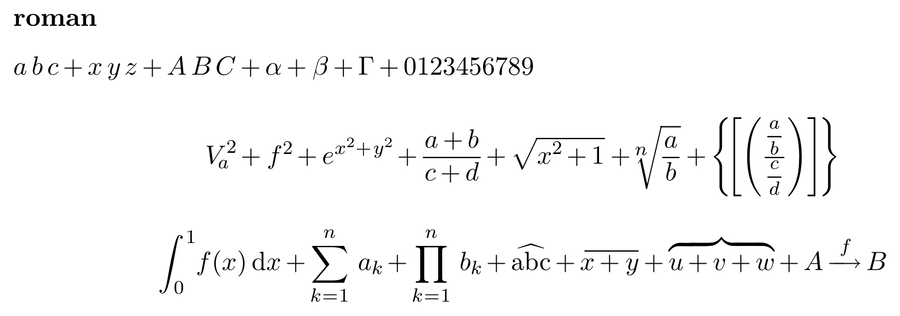

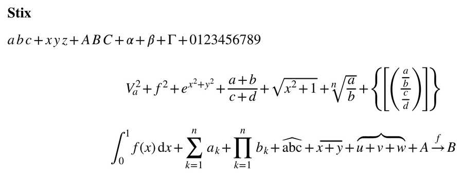

### Shipped with TeXmacs

These five are in `TeXmacs/fonts/truetype` and need no font scan. They take
the MATH path with no hand tuning, so they exercise everything described
above.

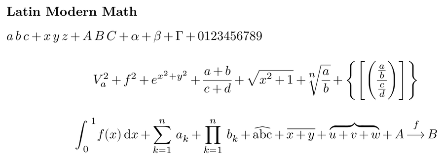

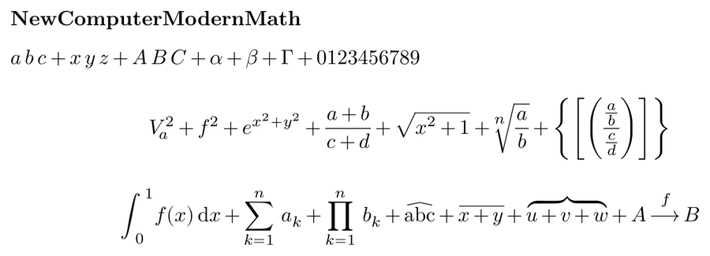

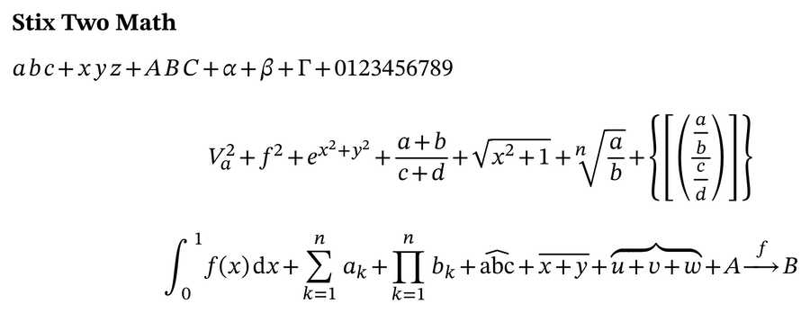

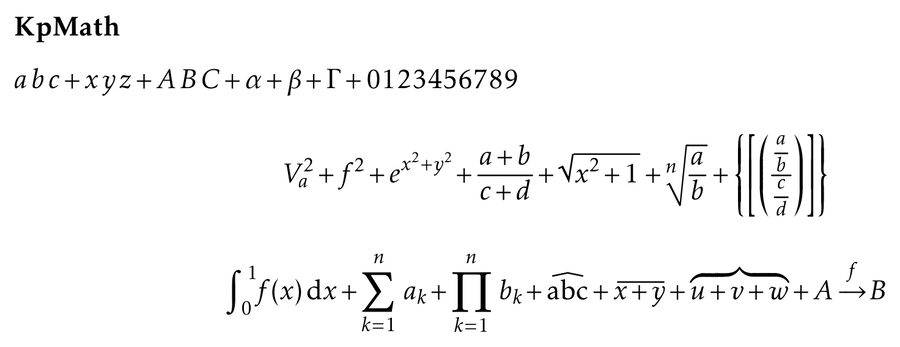

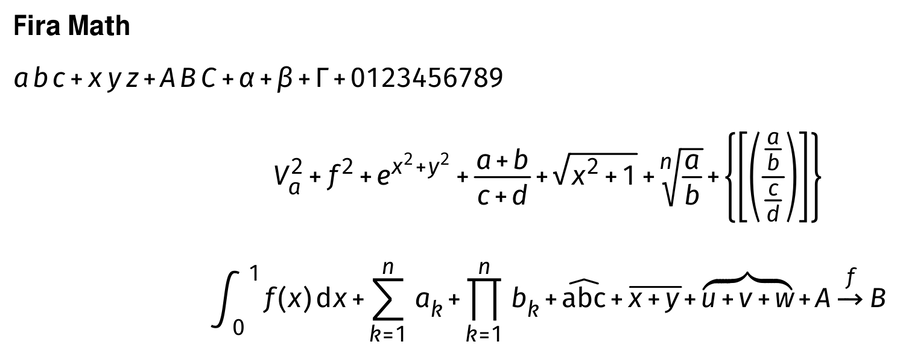

### TeX Gyre

Four of the five keep their hand-tuned tables for corrections, wide accents
and integrals, while the MATH table gives them the delimiter variants, the
assemblies and the constants they never had. TeX Gyre DejaVu Math has no
tuned tables at all and takes the MATH path like the fonts above.

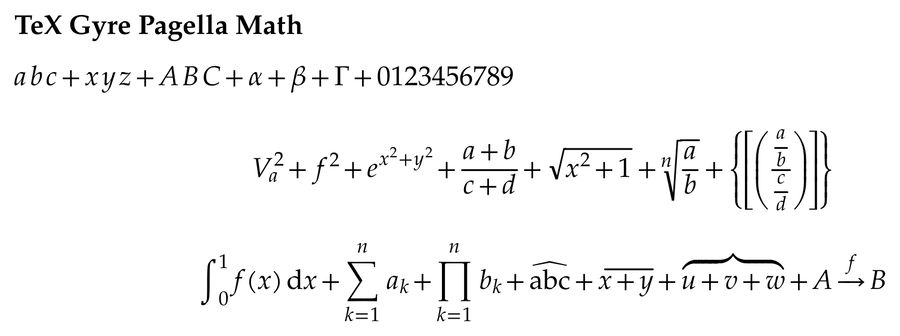

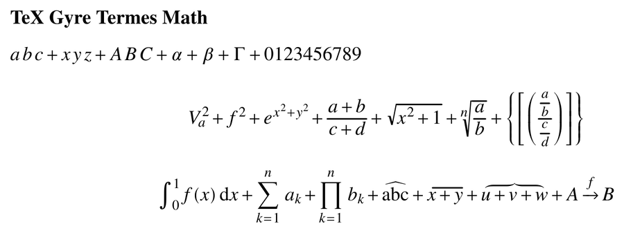

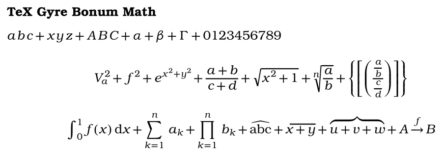

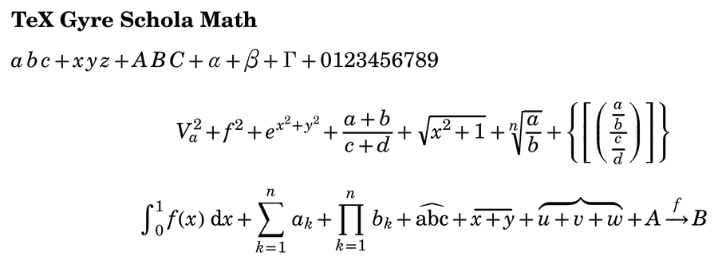

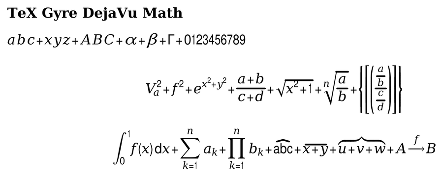

### Other profiled fonts

Profiled and untuned: they work, and their quirks are the fonts' own. XITS
and Libertinus are complete families like the shipped ones, and the survey
in `doc/opentype-math-fonts-survey.md` puts the others one tier lower:
Asana, Erewhon, XCharter, Concrete and Euler for a narrower audience, Lete
Sans Math for sans serif mathematics, GFS Neohellenic with 41 percent of the
alphanumerics, and IBM Plex Math, the font whose display operators needed the
two-em cap.

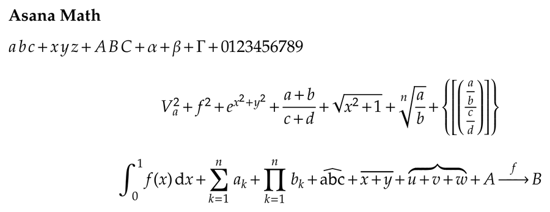

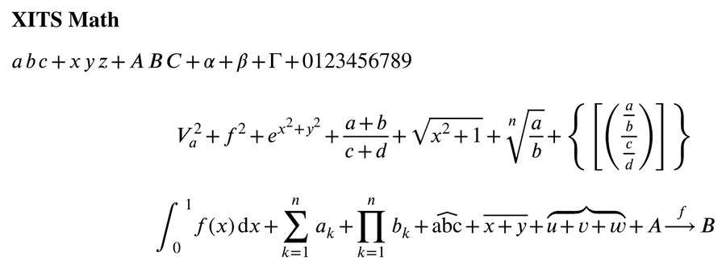

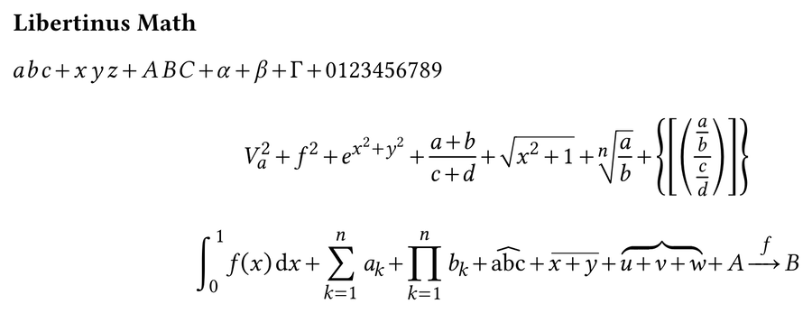

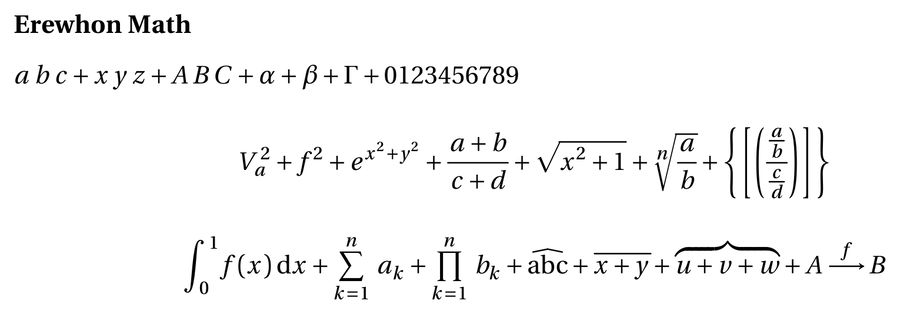

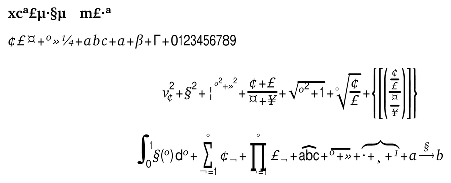

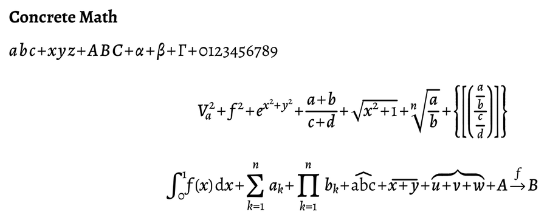

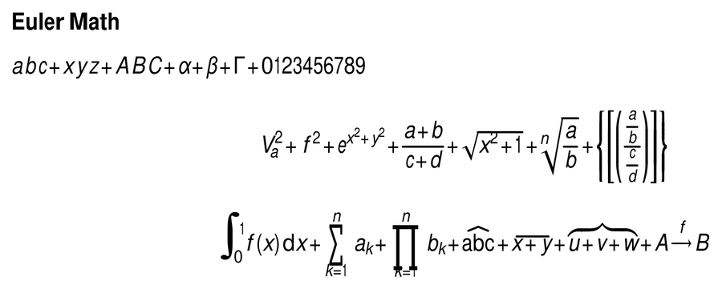

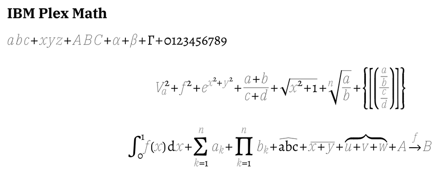

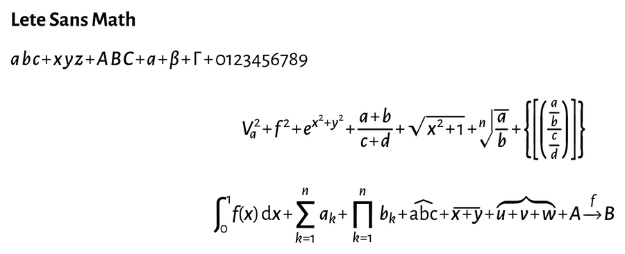

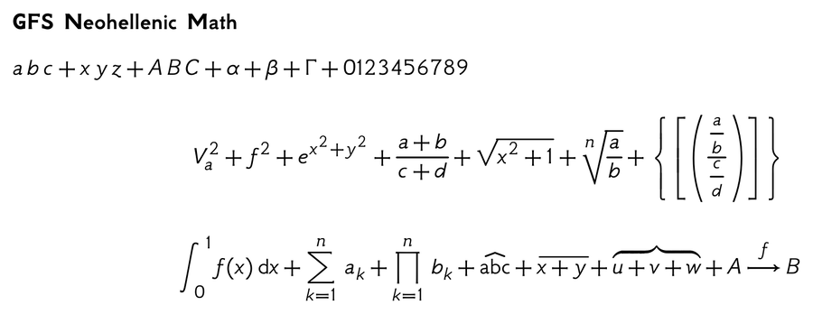

## What is not done

The short version, with the details in section 7 of
`doc/opentype-math-design.md`:

- Alphabets a font provides only in part (script and double-struck in most
  fonts) are silently mixed with the emulated ones; no profile key declares
  what a font really has.
- `delimitedSubFormulaMinHeight`, the device tables and the plain stack
  constants for `above` and `below` are deliberately not applied; the first
  two would diverge from TeX, the third would move every such construct.
- The rest of GPOS (mark attachment) is unused, which affects fonts that
  place accents with `mark`/`mkmk` rather than with the top accent
  attachment.
- The profile test checks each math font, its family name and its MATH table,
  but not that the companion masters a profile names exist or are installed.
- Glyphs TeXmacs glues itself still export as Type 3 bitmap fonts, where the
  PDF writer could place the parts as vectors. The MATH variants and
  assemblies are not affected: they come out of the embedded font subsets.
